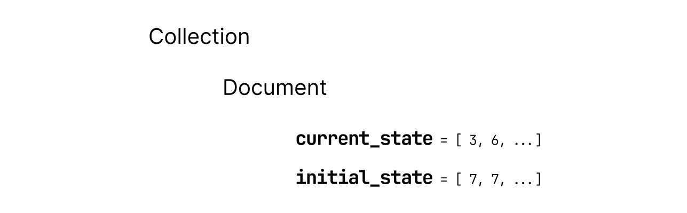

# Unstop Assessment

Deployed here : [https://unstop-assessment-green.vercel.app/](https://unstop-assessment-green.vercel.app/)

## Database Structure

Leveraged **Cloud Firestore**, a NoSQL database for storing two arrays: 

 - `current_state` 
 - `initial_state`

For context, `state` varible represents the number of vacant seat in a given row, corrosponding to the index.